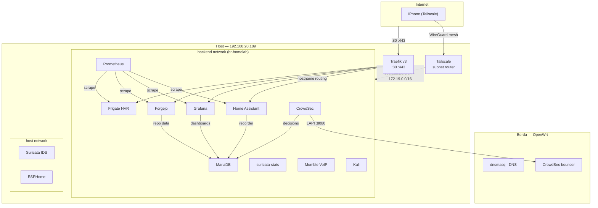

# homelab

Infraestrutura auto-hospedada — Docker Compose, 14 servicos, rede zero-confianca.

[](https://github.com/gustavx404/homelab/actions)
[]()
[]()
[]()

---

## Arquitetura



- **Traefik** e o unico ponto de entrada HTTP/S. Roteia por hostname (`ha.home`, `grafana.home`, `git.home`, `frigate.home`).
- **Tailscale** cria uma mesh WireGuard e expoe toda a LAN como subnet routes — iPhone acessa o lab de qualquer lugar sem portas abertas no roteador.
- **MariaDB** e o banco central, compartilhado por Home Assistant (recorder), Forgejo, Grafana e CrowdSec.
- **Suricata + ESPHome** usam `network_mode: host` (packet capture / mDNS).
- **CrowdSec** envia bans para o OpenWrt na borda via LAPI.

---

## Acesso Remoto (Tailscale)

O container `tailscale` (`compose/tailscale.yaml`) atua como **subnet router**, expondo a
LAN (`192.168.20.0/24`) e a rede Docker (`172.19.0.0/16`) para qualquer dispositivo
na sua rede Tailscale.

### Setup

1. **Crie uma auth key** em https://login.tailscale.com/admin/settings/keys
   - Reusable, ephemeral=false, pre-approved=true
   - Tags: `tag:homelab`

2. **Adicione ao sops**:
   ```bash
   sops compose/sops-secrets.yaml
   # TAILSCALE_AUTHKEY: tskey-auth-xxx...
   bash scripts/decrypt-secrets.sh
   ```

3. **Subir**:
   ```bash
   docker compose -f compose/compose.yaml up -d tailscale
   ```

4. **Aprovar subnet routes** no admin console:
   - Va em Machines > homelab > Edit route settings
   - Aprove `192.168.20.0/24` e `172.19.0.0/16`

### Uso no iPhone

1. Instale o app **Tailscale** (App Store)
2. Faca login na mesma conta
3. Pronto — acesse `https://ha.home`, `https://grafana.home`, etc. como se estivesse em casa
4. O MagicDNS do Tailscale tambem da nomes estaveis (`homelab.tail-xxxx.ts.net`)

---

## HomeKit / Apple Home

A integracao `homekit:` do Home Assistant expoe dispositivos como acessorios
HomeKit, controlaveis pelo app **Casa** e por **Siri** no iPhone/iPad/Apple TV.

### Pre-requisito: avahi-reflector (mDNS entre Docker e LAN)

HomeKit usa Bonjour (mDNS) para descobrir a bridge. Como o HA esta na rede
Docker bridge, o mDNS nao alcanca a LAN por padrao. Solucao: reflector no host.

```bash
sudo apt install avahi-daemon
sudo sed -i 's/#enable-reflector=no/enable-reflector=yes/' /etc/avahi/avahi-daemon.conf
sudo systemctl restart avahi-daemon
```

### Usando

Apos subir o HA com o bloco `homekit:` no `configuration.yaml`:

1. No iPhone, abra o app **Casa**
2. Toque em **+** > Adicionar Acessorio
3. Escaneie o QR code que aparece em:
   HA > Configuracoes > Dispositivos e servicos > HomeKit Bridge
4. Controle dispositivos pelo app Casa ou diga "Hey Siri, acenda a luz"

---

## HA Companion App

O `default_config:` do Home Assistant ja inclui `mobile_app:` — o app Companion
funciona sem config adicional no servidor.

### Instalar no iPhone

1. App Store: **Home Assistant Companion**
2. Login: `https://ha.home` (LAN) ou o IP Tailscale (remoto)
3. Permita notificacoes push e localizacao

### Sensores uteis (automaticos)

| sensor | descricao |
|--------|-----------|
| `sensor.iphone_battery_level` | Nivel da bateria |
| `sensor.iphone_battery_state` | Carregando / Nao carregando |
| `device_tracker.iphone` | Localizacao GPS (p/ automacoes de presenca) |
| `sensor.iphone_steps` | Passos (HealthKit) |
| `sensor.iphone_ssid` | Rede Wi-Fi atual |
| `sensor.iphone_focus` | Modo Foco (Trabalho, Pessoal, etc.) |
| `binary_sensor.iphone_focus_Driving` | Esta dirigindo? |

### Notificacoes

As automacoes do HA usam `notify.notify` (envia p/ todos os destinos:
Companion App, persistent_notification, etc.). Para notificar so no iPhone,
substitua por `notify.mobile_app_iphone` nos arquivos `automations.yaml` e
`scripts.yaml`.

---

## Instalacao

```bash
# dependencias
curl -fsSL https://get.docker.com -o get-docker.sh && sudo sh ./get-docker.sh
sudo apt install -y docker-compose-v2 age yamllint avahi-daemon
curl -LO https://github.com/getsops/sops/releases/download/v3.13.3/sops-v3.13.3.linux.amd64
sudo install -m 755 sops-v3.13.3.linux.amd64 /usr/local/bin/sops

# avahi-reflector p/ HomeKit (mDNS entre Docker e LAN)
sudo sed -i 's/#enable-reflector=no/enable-reflector=yes/' /etc/avahi/avahi-daemon.conf
sudo systemctl enable --now avahi-daemon

# gerar chave age e copiar chave publica para .sops.yaml
age-keygen -o ~/.config/sops/age/keys.txt

# editar secrets com valores reais
sops compose/sops-secrets.yaml

# decriptar e gerar .env
bash scripts/decrypt-secrets.sh

# subir todos os stacks
docker compose -f compose/compose.yaml up -d
```

**DNS** — hostnames `.home` (ha, grafana, git, frigate) resolvem via
dnsmasq do roteador OpenWrt (`/etc/hosts` no LuCI) para `192.168.20.189`.
A lista de hostnames precisa bater com as rotas em `traefik/dynamic.yml`.

**Acesso** — hostname-based routing, TLS auto-assinado.

| hostname | servico |
|----------|---------|
| `ha.home` | Home Assistant |
| `grafana.home` | Grafana |
| `git.home` | Forgejo |
| `frigate.home` | Frigate (NVR) |

---

## Servicos

| stack | servico | imagem | acesso |
|-------|---------|--------|--------|
| services | traefik | `v3.3` | `80,443` |
| home | homeassistant | `stable` | interno |
| database | mariadb | `lts` | interno |
| home | esphome | `stable` | `6052` host |
| security | suricata | `latest` | host |
| security | suricata-stats | `python:3.13-alpine` | interno `8899` |
| security | crowdsec | `latest` | `8080` lapi |
| services | forgejo | `16.0.2` | `2222` ssh |
| services | mumble | `latest` | `64738` tcp/udp |
| services | kali | `rolling` | cli |
| monitoring | prometheus | `v3.4.0` | `127.0.0.1:9090` |
| monitoring | grafana | `11.6.0` | `127.0.0.1:3000` |
| media | frigate | `stable` | `8554,8555` |
| network | tailscale | `latest` | subnet router |

### Banco de dados (MariaDB)

MariaDB e o banco central (`compose/database.yaml`, rede `backend`), compartilhado por:

| app | banco | usuario |
|-----|-------|---------|
| Home Assistant (recorder) | homeassistant | ha_user |
| Forgejo | forgejo | forgejo |
| Grafana | grafana | grafana |
| CrowdSec | crowdsec | crowdsec |

Bancos e usuarios das apps sao criados no primeiro boot por
`compose/database-init/01-create-app-databases.sh` (montado em
`/docker-entrypoint-initdb.d`). Senhas centralizadas no SOPS
(`FORGEJO_DB_PASSWORD`, `GRAFANA_DB_PASSWORD`, `CROWDSEC_DB_PASSWORD`).

Nao usam MariaDB de proposito: Mumble (SQLite — volume baixo ou sem
suporte a MySQL, evita dependencia no banco central).

---

## Estrutura

```
compose/
├── compose.yaml        principal (include)
├── network.yaml        rede + secrets
├── tailscale.yaml      acesso remoto (subnet router WireGuard)
├── database.yaml       mariadb (banco central: HA · forgejo · grafana · crowdsec)
├── database-init/      01-create-app-databases.sh (bancos/usuarios no primeiro boot)
├── home.yaml           homeassistant · esphome
├── security.yaml       suricata · crowdsec · suricata-stats
├── monitoring.yaml     prometheus · grafana
├── media.yaml          frigate (NVR)
├── services.yaml       traefik · forgejo · mumble · kali
├── .env.example        template
├── sops-secrets.yaml   encriptado (SOPS + age)
└── sops-secrets.template.yaml  template SOPS (init-sops)

traefik/                config do proxy reverso
frigate/                config NVR (detector CPU, cameras)
suricata/               config IDS + 12 assinaturas
crowdsec/               acquis · profiles · scenarios · whitelist · notifications
homeassistant/          config HA + dispositivos ESPHome
monitoring/             configs prometheus + grafana
scripts/                init-sops · decrypt-secrets · update-suricata-rules · suricata-stats
```

Stacks individuais:

```bash
docker compose -f compose/network.yaml -f compose/database.yaml -f compose/security.yaml up -d
docker compose -f compose/network.yaml -f compose/database.yaml -f compose/home.yaml up -d
docker compose -f compose/network.yaml -f compose/media.yaml up -d
```

Stacks que usam o banco central (home, security, services, monitoring) exigem compose/database.yaml na lista.

---

## IDS/IPS

Suricata monitora `eno1` e `br-homelab`. CrowdSec processa `eve.json` em tempo real. Tres alertas de scan em 60 segundos disparam um ban, propagado para o OpenWrt na borda (duracao conforme o perfil abaixo).

| assinatura | limite |
|-----------|--------|
| icmp echo | informativo |
| varredura icmp | 10 / 30s |
| syn scan | 5 / 3s |
| connect scan | 5 / 3s |
| null scan | 3 / 10s |
| fin scan | 3 / 10s |
| xmas scan | 3 / 10s |
| port scan | 10 / 5s |
| udp scan | 5 / 3s |
| ssh brute force | 8 / 30s |
| path traversal | — |
| sql injection | — |

`suricata-stats` expoe stats em tempo real do Suricata (endpoint interno `:8899` que le o `eve.json`): uptime, pacotes, drops e total de alertas. Apos editar `suricata/suricata.yaml`, recrie o container:

```bash
docker compose -f compose/network.yaml -f compose/security.yaml up -d --force-recreate suricata
```

Perfis CrowdSec — cenario `homelab/scan-detection` (ordem importa: o mais
especifico vem primeiro, `on_success: break`):

| gatilho | duracao |
|---------|---------|
| reincidente (>=3 eventos) | 48 h |
| padrao de scan | 24 h |
| primeira deteccao | 6 h |

**Notificacoes**: cada ban dispara um webhook para o Home Assistant
(`crowdsec/notifications/ha-webhook.yaml`, perfil `ha_alerts` no
`crowdsec/profiles.yaml`), que repassa o alerta para os apps via
`notify.notify`. O ID do webhook vem do SOPS (`HA_WEBHOOK_ID`, default
`crowdsec_alerts`) e a automacao correspondente esta em
`homeassistant/automations.yaml`. Teste:
`docker exec crowdsec cscli notifications test ha_alerts`.

**Whitelist RFC1918**: `crowdsec/whitelists.yaml` branqueia `127.0.0.1`, a LAN
(`192.168.20.0/24`) e as redes Docker (`172.16.0.0/12`, `10.0.0.0/8`) — trafego
interno nunca gera ban (so protecao da borda via OpenWrt). Apos editar
`crowdsec/whitelists.yaml`, `profiles.yaml` ou `scenarios/`, recrie o container:

```bash
docker compose -f compose/compose.yaml up -d --force-recreate crowdsec
```

**Community blocklist (CAPI)**: habilitado com
`docker exec crowdsec cscli console enable console_management` — as decisoes da
comunidade (`ssh:bruteforce` etc.) aparecem em `cscli decisions list` com origem
`CAPI` e o OpenWrt as aplica na borda. Para o bouncer do OpenWrt puxar a
blocklist, ele precisa pedir `community_pull=true` no stream (config do bouncer
no roteador; hoje esta `false`).

```bash
docker exec crowdsec cscli decisions list      # bans ativos (origem CAPI/local)
docker exec crowdsec cscli console status      # estado do console (blocklist)
docker exec kali nmap -sS -p 1-100 <host>     # teste
```

---

## Portas expostas

| porta | servico | motivo |
|-------|---------|--------|
| `22` | ssh | acesso administrativo |
| `80,443` | traefik | unico ponto de entrada |
| `2222` | forgejo ssh | git push/pull |
| `6052` | esphome | host network (mDNS) |
| `64738` | mumble | protocolo VoIP |
| `8080` | crowdsec lapi | bouncer OpenWrt |
| `8554` | frigate | RTSP restream |
| `8555` | frigate | WebRTC tcp/udp |

Nenhum app web exposto diretamente — tudo passa pelo Traefik.
Tailscale nao expoe porta — conexao outbound WireGuard com NAT traversal.

---

## Seguranca

- todos os apps web acessiveis apenas via Traefik
- prometheus vinculado apenas a `127.0.0.1` (metricas internas)
- mariadb isolado na rede `backend`
- secrets encriptados com SOPS + age (`.env` gitignored)
- `network_mode: host` apenas onde necessario (suricata, esphome, tailscale)
- `suricata-stats` le o `eve.json` somente-leitura (rede `backend`, porta interna, sem bind)
- `no-new-privileges:true` nos containers host
- healthchecks em todos os containers; resource limits em todos exceto tailscale
- CI: yamllint, compose-validate, trivy config, trivy cve (9 imagens)
- Tailscale: auth key ephemeral, subnet routes aprovadas manualmente no admin console

---

## Backup

```bash
tar -czf backup-$(date +%Y%m%d).tar.gz data/
cp ~/.config/sops/age/keys.txt backup-age-key.txt
```

---

## Usar como template

Este repositorio e um ponto de partida para montar o proprio lab.

1. Clique em **Use this template** (ou fork) no GitHub
2. Clone e gere seus secrets:

```bash
bash scripts/init-sops.sh          # chave age + encripta sops-secrets.template.yaml
sops compose/sops-secrets.yaml     # preencha valores reais
bash scripts/decrypt-secrets.sh    # gera compose/.env
docker compose -f compose/compose.yaml up -d
```

3. Ajuste os hostnames em `traefik/dynamic.yml` e o DNS do roteador.
4. Veja `SECURITY.md` para rotacao de chaves e hardening do GitHub.

> O `compose/sops-secrets.yaml` versionado so decripta com a chave age do autor.
> O script `init-sops.sh` encripta o template com a **sua** chave, do zero.

---

## Creditos

| projeto | autor |
|---------|-------|
| [EASUN SMG II 11Kw ESPHome](https://github.com/robgt978/Easun-SMG-II-11Kw-esphome-) | robgt978 |
| [Tailscale](https://tailscale.com/) | Tailscale Inc. |
| [Suricata](https://suricata.io/) | OISF |
| [CrowdSec](https://github.com/crowdsecurity/crowdsec) | CrowdSec |
| [Mumble](https://github.com/mumble-voip/mumble) | Mumble VoIP |
| [Traefik](https://github.com/traefik/traefik) | Traefik Labs |
| [Forgejo](https://forgejo.org/) | Forgejo |
| [ESPHome](https://esphome.io/) | ESPHome |
| [Home Assistant](https://www.home-assistant.io/) | Home Assistant |
| [Grafana](https://grafana.com/) | Grafana Labs |
| [Prometheus](https://prometheus.io/) | Prometheus |
| [Frigate](https://frigate.video/) | Blake Blackshear |
| [SOPS](https://github.com/getsops/sops) | Mozilla |
| [age](https://github.com/FiloSottile/age) | Filippo Valsorda |

Feito por [gustavx404](https://github.com/gustavx404).
