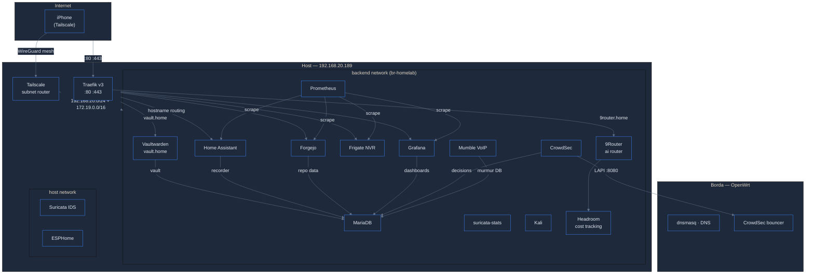

<p align="center">
  <h1 align="center">homelab</h1>
  <p align="center">
    <b>Infraestrutura auto-hospedada</b><br>
    Docker Compose &middot; 26 servicos &middot; Zero-confianca
  </p>
</p>

<p align="center">
  <a href="https://github.com/gustavx404/homelab/actions"></a>
  
  
  
</p>

<p align="center">
  
  
  
  
  
  
  
  
  
  
  
</p>

---

### Indice

- [Arquitetura](#arquitetura) — diagrama da infraestrutura
- [Acesso Remoto](#acesso-remoto-tailscale) — Tailscale (WireGuard mesh)
- [Apple](#apple) — HomeKit, Siri, Companion App
- [Instalacao](#instalacao) — do zero ao ar em 5 minutos
- [Servicos](#servicos) — catalogo completo com 28 containers
- [9Router (AI Router)](#9router-ai-router) — LLM router & token saver
- [Banco de dados](#banco-de-dados-mariadb) — MariaDB central
- [Estrutura](#estrutura) — arvore de diretorios
- [Seguranca](#seguranca) — IDS/IPS, CrowdSec, hardenings
- [Backup](#backup) — rotina de backup
- [Template](#usar-como-template) — fork e personalize

---

## Arquitetura



| componente | funcao |
|---|---|
| Traefik | Unico ponto de entrada HTTP/S — roteia `*.home` por hostname |
| Tailscale | Mesh WireGuard — iPhone acessa tudo de qualquer lugar, sem portas abertas |
| MariaDB | Banco central — HA (recorder), Forgejo, Grafana, CrowdSec, Mumble, Vaultwarden |
| Suricata + CrowdSec | IDS/IPS — detecta scans, aplica bans, notifica via HA webhook |
| Prometheus + Grafana | Metricas e dashboards de todos os servicos |
| 9Router | AI Router & Token Saver — roteia LLM requests (OpenAI/Anthropic/Gemini/locals), dashboard em https://9router.home |
| Headroom | Cost tracking sidecar para 9Router — metricas de gasto por modelo |

---

## Acesso Remoto (Tailscale)

O container `tailscale` atua como **subnet router**, expondo a LAN
(`192.168.20.0/24`) e a rede Docker (`172.19.0.0/16`) via WireGuard.

<details open>
<summary><b>Setup (4 passos)</b></summary>

1. **Crie uma auth key** em [login.tailscale.com/admin/settings/keys](https://login.tailscale.com/admin/settings/keys)
   - Reusable, ephemeral=false, pre-approved=true
   - Tags: `tag:homelab`

2. **Adicione ao sops**:
   ```bash
   sops compose/sops-secrets.yaml        # TAILSCALE_AUTHKEY: tskey-auth-xxx...
   bash scripts/decrypt-secrets.sh
   ```

3. **Subir**:
   ```bash
   docker compose -f compose/compose.yaml up -d tailscale
   ```

4. **Aprovar subnet routes** no [admin console](https://login.tailscale.com/admin/machines):
   Machines > homelab > Edit route settings > aprovar `192.168.20.0/24` e `172.19.0.0/16`

</details>

### ScaleTail (sidecars)

O [ScaleTail](https://github.com/tailscale-dev/ScaleTail) e um conjunto de configs
Docker Compose com sidecar Tailscale — cada servico ganha URL propria
`https://<app>.<tailnet>.ts.net` via **Tailscale Serve** (HTTPS automatico, sem portas
abertas). No homelab, 3 servicos usam sidecars dedicados: Home Assistant,
Forgejo e Vaultwarden. Cada um tem seu proprio `*-serve.json` e auth key
reutilizavel com tags `tag:homelab` (ja no sops como `TAILSCALE_AUTHKEY`).

O subnet router (`tailscale.yaml`) complementa os sidecars, expondo a LAN e a rede
Docker para servicos sem sidecar proprio (Grafana, Frigate, Prometheus, etc).

> **iPhone**: instale o app Tailscale, faca login na mesma conta — `https://ha.home`,
> `https://grafana.home`, etc. funcionam como se estivesse em casa.

---

## Apple

### HomeKit Bridge

Expoe dispositivos do HA como acessorios HomeKit — controle pelo app **Casa**
ou **Siri** no iPhone/iPad/Apple TV/HomePod.

**Pre-requisito**: avahi-daemon no host com reflector (mDNS entre Docker bridge e LAN):

```bash
sudo apt install avahi-daemon
sudo sed -i 's/#enable-reflector=no/enable-reflector=yes/' /etc/avahi/avahi-daemon.conf
sudo systemctl restart avahi-daemon
```

A config `homekit:` ja esta no `homeassistant/configuration.yaml`. Apos subir
o HA, abra o app **Casa** > **+** > Adicionar Acessorio > escaneie o QR code em
HA > Configuracoes > Dispositivos e servicos > HomeKit Bridge.

### Companion App

O `default_config:` do HA ja inclui `mobile_app:` — zero config no servidor.

1. App Store: **Home Assistant Companion** > login em `https://ha.home`
2. Sensores automaticos: bateria, GPS, passos, SSID Wi-Fi, modo Foco, direcao

As automacoes usam `notify.notify` (envia p/ todos os destinos). Para
direcionar so ao iPhone, troque por `notify.mobile_app_iphone` nos
arquivos `automations.yaml` e `scripts.yaml`.

---

## Instalacao

```bash
# dependencias
curl -fsSL https://get.docker.com -o get-docker.sh && sudo sh ./get-docker.sh
sudo apt install -y docker-compose-v2 age yamllint avahi-daemon
curl -LO https://github.com/getsops/sops/releases/download/v3.13.3/sops-v3.13.3.linux.amd64
sudo install -m 755 sops-v3.13.3.linux.amd64 /usr/local/bin/sops

# avahi-reflector (HomeKit — mDNS entre Docker e LAN)
sudo sed -i 's/#enable-reflector=no/enable-reflector=yes/' /etc/avahi/avahi-daemon.conf
sudo systemctl enable --now avahi-daemon

# secrets
age-keygen -o ~/.config/sops/age/keys.txt     # gera chave age
sops compose/sops-secrets.yaml                 # edita valores reais
bash scripts/decrypt-secrets.sh                # gera compose/.env

# subir tudo
docker compose -f compose/compose.yaml up -d
```

**DNS local**: hostnames `.home` resolvem via dnsmasq do OpenWrt (LuCI > `/etc/hosts`
apontando `192.168.20.189`). Devem bater com `traefik/dynamic.yml`.

**DNS Tailscale**: cada servico com sidecar Tailscale tem node proprio no tailnet
(`ha.<tailnet>.ts.net`, `git.<tailnet>.ts.net`,
`vault.<tailnet>.ts.net`). O subnet router
(`homelab.<tailnet>.ts.net`) expoe a LAN e a rede Docker para servicos sem
sidecar dedicado. Acesseis de qualquer dispositivo no tailnet sem VPN extra,
sem porta aberta, sem DNS local.

| hostname | servico | local | Tailscale |
|---|---|---|---|
| `ha.home` | Home Assistant | :white_check_mark: | `ha1.<tailnet>.ts.net` |
| `grafana.home` | Grafana | :white_check_mark: | — |
| `git.home` | Forgejo | :white_check_mark: | `git.<tailnet>.ts.net` |
| `frigate.home` | Frigate (NVR) | :white_check_mark: | — |
| `vault.home` | Vaultwarden (senhas) | :white_check_mark: | `vault.<tailnet>.ts.net` |
| `9router.home` | 9Router (AI Router) | :white_check_mark: | `9router.<tailnet>.ts.net` |
| `mumble://100.73.57.112:64738` | Mumble (VoIP) | Tailscale IP | direto (protocolo proprio) |

> Para acesso **publico** (internet, sem Tailscale): habilite Funnel no
> [admin console](https://login.tailscale.com/admin/dns) > Domains > Enable HTTPS
> Certificates + Funnel. Depois troque `false` por `true` nos dominios desejados
> em `compose/tailscale-serve.json`.

---

## Servicos

| stack | servico | imagem | acesso | rede |
|---|---|---|---|---|
| services | traefik | `v3.3` | `:80,443` | backend |
| home | homeassistant | `stable` | interno | backend |
| database | mariadb | `lts` | interno | backend |
| home | esphome | `stable` | `:6052` | host |
| security | suricata | `latest` | — | host |
| security | crowdsec | `latest` | `:8080` lapi | backend |
| security | suricata-stats | `python:3.13-alpine` | `:8899` interno | backend |
| services | forgejo | `16.0.2` | `:2222` ssh | backend |
| services | mumble | `latest` | `:64738` tcp/udp | backend |
| services | kali | `rolling` | cli | backend |
| monitoring | prometheus | `v3.4.0` | `127.0.0.1:9090` | backend |
| monitoring | grafana | `11.6.0` | `127.0.0.1:3000` | backend |
| media | frigate | `stable` | `:8554,8555` | backend |
| vaultwarden | vaultwarden | `1.37.1` | `vault.home` | backend |
| network | tailscale | `latest` | subnet router | host |
| 9router | 9router | `0.5.55` | `9router.home` | backend |
| 9router | headroom | `latest` | interno | backend |
| home | ts-homeassistant | `latest` | `https://ha1.<tailnet>.ts.net` | backend |
| services | ts-forgejo | `latest` | `https://git.<tailnet>.ts.net` | backend |
| vaultwarden | ts-vaultwarden | `latest` | `https://vault.<tailnet>.ts.net` | backend |

---

## Banco de dados (MariaDB)

Container `mariadb:lts`, rede `backend`, 512M RAM, 50 conexoes, `utf8mb4`.
Provisionamento em duas camadas no primeiro boot (datadir vazio):

1. **Entrypoint do MariaDB**: cria o banco `homeassistant` e usuario `ha_user`
   via secrets Docker (`MARIADB_DATABASE`, `MARIADB_USER`, `MARIADB_PASSWORD`)
2. **Init script** (`database-init/01-create-app-databases.sh`): cria os bancos
   e usuarios de Forgejo, Grafana, CrowdSec, Mumble e Vaultwarden

| app | banco | usuario | secret SOPS |
|---|---|---|---|
| — (root) | — | root | `MARIADB_ROOT_PASSWORD` |
| Home Assistant (recorder) | homeassistant | ha_user | `MARIADB_USER`, `MARIADB_PASSWORD`, `MARIADB_DATABASE` |
| Forgejo | forgejo | forgejo | `FORGEJO_DB_PASSWORD` |
| Grafana | grafana | grafana | `GRAFANA_DB_PASSWORD` |
| CrowdSec | crowdsec | crowdsec | `CROWDSEC_DB_PASSWORD` |
| Mumble (murmur) | mumble | mumble | `MUMBLE_DB_PASSWORD` |
| Vaultwarden | vaultwarden | vaultwarden | `VAULTWARDEN_DB_PASSWORD` |

> Senhas repassadas como env var no compose. HA constroi a connection string
> internamente (`ha-entrypoint.sh`). Root password via Docker secret (`_FILE`),
> nunca exposta como env var. Init script so roda com datadir vazio — idempotente.

---

## 9Router (AI Router)

[9Router](https://github.com/decolua/9router) e um **roteador LLM gratuito** — recebe requests
OpenAI/Anthropic/Gemini/Ollama, escolhe o melhor modelo (custo/qualidade/latencia) e
responde via API compativel. Dashboard web em `https://9router.home` (via Traefik).

Stack `compose/9router.yaml` (rede `backend`, sem portas expostas no host):

| servico | imagem | funcao |
|---|---|---|
| 9router | `decolua/9router:0.5.55` | API router + UI (`:20128` interno) |
| headroom | `ghcr.io/chopratejas/headroom:latest` | Cost tracking sidecar (`:8787` interno) |

**Setup (1x)**:

```bash
# Gere senha forte p/ admin inicial
openssl rand -base64 32

# Adicione ao sops (valor encriptado)
sops compose/sops-secrets.yaml   # 9ROUTER_INITIAL_PASSWORD: <senha_gerada>
bash scripts/decrypt-secrets.sh
docker compose -f compose/compose.yaml up -d 9router
```

**Acesso**:
- LAN/tailnet: `https://9router.home` (via Traefik)
- Dashboard: `https://9router.home` — login com `admin` / senha do `9ROUTER_INITIAL_PASSWORD`
- API OpenAI-compat: `https://9router.home/v1` — use como baseURL no cliente (ex.: `openai.baseURL`)

**Providers suportados** (configurados no dashboard UI):
- OpenAI (GPT-4o, GPT-4o-mini, o1, etc)
- Anthropic (Claude 3.5 Sonnet, Haiku, Opus)
- Google (Gemini 1.5 Pro/Flash)
- Ollama (modelos locais via `http://host.docker.internal:11434`)
- OpenRouter, Groq, Together, DeepSeek, etc

**Routing rules** (UI > Routes): defina prioridade por custo, latencia, qualidade, ou modelo especifico.
Headroom (`http://headroom:8787`) coleta metricas de custo/tokens por request — visiveis no dashboard.

> **Seguranca**: `INITIAL_PASSWORD` via Docker secret (`/run/secrets/9ROUTER_INITIAL_PASSWORD`), nunca env var.
> Containers com `cap_drop: [ALL]`, `read_only: true`, `no-new-privileges:true`.

> **Alternativa**: [OmniRouter](https://github.com/omnilabs-ai/OmniRouter) — projeto similar de roteamento LLM. Ainda sem imagem Docker oficial publicada. Quando disponivel, migracao simples: trocar imagem no `compose/9router.yaml` e ajustar variaveis de ambiente.

---
## Estrutura

```
compose/
├── compose.yaml           principal (include)
├── network.yaml           rede + secrets
├── tailscale.yaml         acesso remoto (subnet router WireGuard)
├── database.yaml          mariadb
├── database-init/         01-create-app-databases.sh
├── home.yaml              homeassistant · esphome
├── security.yaml          suricata · crowdsec · suricata-stats
├── monitoring.yaml        prometheus · grafana
├── media.yaml             frigate (NVR)
├── vaultwarden.yaml       vaultwarden (senhas, MariaDB central)
├── services.yaml          traefik · forgejo · mumble · kali
├── 9router.yaml           9router (AI Router) + headroom
├── tailscale-serve.json   serve config do subnet router (Funnel)
├── ha-serve.json          serve config do sidecar homeassistant
├── forgejo-serve.json     serve config do sidecar forgejo
├── vaultwarden-serve.json serve config do sidecar vaultwarden
├── .env.example           template
├── sops-secrets.yaml      encriptado (SOPS + age)
└── sops-secrets.template.yaml

traefik/     proxy reverso (rotas, TLS, middlewares)
frigate/     NVR (detector CPU, cameras)
suricata/    IDS + 12 assinaturas
crowdsec/    acquis · profiles · scenarios · whitelist · notifications
homeassistant/  HA + ESPHome
monitoring/  prometheus + grafana dashboards
data/        volumes persistentes (mount de todos os containers; alvo do backup)
.github/     CI (yamllint · compose validate · trivy config e imagem)
scripts/     init-sops · decrypt-secrets · update-suricata-rules · suricata-stats · mumble-setup
```

Stacks podem subir individualmente com `compose/network.yaml` (obrigatorio) +
`database.yaml` (se usar o banco central):

```bash
docker compose -f compose/network.yaml -f compose/database.yaml -f compose/security.yaml up -d
docker compose -f compose/network.yaml -f compose/database.yaml -f compose/home.yaml up -d
```

---

## Seguranca

### IDS/IPS

Suricata em `eno1` + `br-homelab`. CrowdSec processa `eve.json` — 3 alertas
em 60s disparam ban (duracao pelo perfil).

<details>
<summary><b>12 assinaturas</b></summary>

| assinatura | limite |
|---|---|
| icmp echo | informativo |
| varredura icmp | 10 / 30s |
| syn scan | 5 / 3s |
| connect scan | 5 / 3s |
| null scan | 3 / 10s |
| fin scan | 3 / 10s |
| xmas scan | 3 / 10s |
| port scan | 10 / 5s |
| udp scan | 5 / 3s |
| ssh brute force | 8 / 30s |
| path traversal | — |
| sql injection | — |

</details>

<details>
<summary><b>Perfis CrowdSec (ordem importa, on_success: break)</b></summary>

| gatilho | duracao |
|---|---|
| reincidente (>=3 eventos) | 48 h |
| padrao de scan | 24 h |
| primeira deteccao | 6 h |

</details>

**Notificacoes**: ban dispara webhook p/ HA
(`crowdsec/notifications/ha-webhook.yaml`, perfil `ha_alerts`), que repassa
via `notify.notify`. Webhook ID no SOPS (`HA_WEBHOOK_ID`).
Teste: `docker exec crowdsec cscli notifications test ha_alerts`

**Whitelist RFC1918**: `127.0.0.1`, `192.168.20.0/24` e redes Docker
(`172.16.0.0/12`, `10.0.0.0/8`) nunca geram ban.

**CAPI**: `docker exec crowdsec cscli console enable console_management` ativa
a blocklist da comunidade — os bans aparecem em `cscli decisions list` com
origem `CAPI` e o OpenWrt os aplica na borda.

```bash
docker exec crowdsec cscli decisions list    # bans ativos
docker exec crowdsec cscli console status    # estado CAPI
```

---

## Mumble (VoIP)

Servidor Murmur com 4 canais (`Home`, `Study`, `Gaming`, `AFK`), IPv4 + IPv6.

Setup inicial (canais e ACLs):
```bash
bash scripts/mumble-setup.sh
```

Conectar como SuperUser p/ administrar:
- **Name**: `SuperUser`
- **Password**: `MUMBLE_CONFIG_supw` (sops)
- **IPv4**: `mumble://192.168.20.189:64738`
- **Tailscale**: `mumble://100.73.57.112:64738` (qualquer lugar, zero firewall)

---

### Hardenings

- Apps web acessiveis apenas via Traefik (hostname routing + TLS)
- Prometheus bind `127.0.0.1`; MariaDB isolado na rede `backend`
- `network_mode: host` so onde necessario (suricata, esphome, tailscale)
- `no-new-privileges:true`, healthchecks e resource limits em todos os containers
- Secrets: SOPS + age (`.env` gitignored, `.sops.yaml` com chave publica commitavel)
- Tailscale: auth key ephemeral, subnet routes aprovadas manualmente
- 9Router: `INITIAL_PASSWORD` via Docker secret, `cap_drop: [ALL]`, `read_only: true`, `no-new-privileges:true`
- Vaultwarden: senhas (DB, redis, admin token) via Docker secrets
  (`_FILE`/`/run/secrets`), nunca env vars

### Portas expostas

| porta | servico | motivo |
|---|---|---|
| `22` | ssh | admin |
| `80,443` | traefik | entrada HTTP/S |
| `2222` | forgejo | git ssh |
| `6052` | esphome | host (mDNS) |
| `64738` | mumble | VoIP (IPv4 + IPv6) |
| `8080` | crowdsec | LAPI (bouncer OpenWrt) |
| `8554` | frigate | RTSP |
| `8555` | frigate | WebRTC |

Tailscale nao expoe porta (WireGuard outbound com NAT traversal).

---

## Backup

```bash
tar -czf backup-$(date +%Y%m%d).tar.gz data/
cp ~/.config/sops/age/keys.txt backup-age-key.txt
```

---

## Usar como template

1. Clique em **Use this template** (ou fork) no GitHub
2. Clone e gere seus secrets:

```bash
bash scripts/init-sops.sh          # chave age + encripta template
sops compose/sops-secrets.yaml     # preencha valores reais
bash scripts/decrypt-secrets.sh    # gera compose/.env
docker compose -f compose/compose.yaml up -d
```

3. Ajuste os hostnames em `traefik/dynamic.yml` e o DNS do roteador
4. Veja [SECURITY.md](SECURITY.md) para rotacao de chaves e hardening do GitHub

> O `sops-secrets.yaml` versionado so decripta com a chave age do autor.
> `scripts/init-sops.sh` encripta o template com a **sua** chave, do zero.

---

## Creditos

| projeto | autor |
|---|---|
| [EASUN SMG II ESPHome](https://github.com/robgt978/Easun-SMG-II-11Kw-esphome-) | robgt978 |
| [Tailscale](https://tailscale.com/) | Tailscale Inc. |
| [ScaleTail](https://github.com/tailscale-dev/ScaleTail) | Tailscale |
| [9Router](https://github.com/decolua/9router) | decolua |
| [Suricata](https://suricata.io/) | OISF |
| [CrowdSec](https://github.com/crowdsecurity/crowdsec) | CrowdSec |
| [Mumble](https://github.com/mumble-voip/mumble) | Mumble VoIP |
| [Traefik](https://github.com/traefik/traefik) | Traefik Labs |
| [Forgejo](https://forgejo.org/) | Forgejo |
| [ESPHome](https://esphome.io/) | ESPHome |
| [Home Assistant](https://www.home-assistant.io/) | Home Assistant |
| [Grafana](https://grafana.com/) | Grafana Labs |
| [Prometheus](https://prometheus.io/) | Prometheus |
| [Frigate](https://frigate.video/) | Blake Blackshear |
| [SOPS](https://github.com/getsops/sops) | Mozilla |
| [age](https://github.com/FiloSottile/age) | Filippo Valsorda |

<p align="center">Feito por <a href="https://github.com/gustavx404">gustavx404</a></p>
